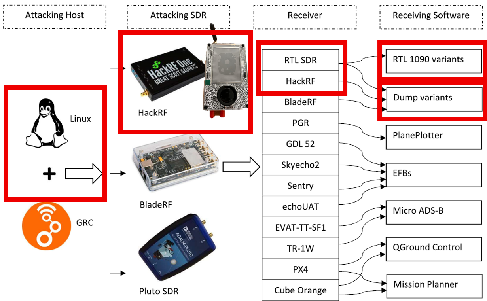
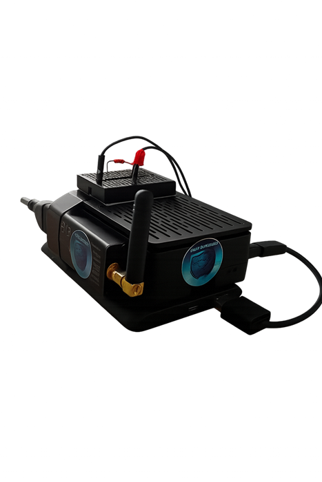

# ✈️ CyberSkyGuard - Detección de Ciberataques al Sistema ADS-B


**CyberSkyGuard** es un sistema autónomo desarrollado para detectar en tiempo real ciberataques al sistema de vigilancia aérea ADS-B, basado en una Raspberry Pi 4. Utiliza un RTL-SDR para capturar tráfico aéreo, analiza los mensajes en tiempo real con algoritmos de detección de anomalías y reporta ataques como *GPS spoofing*, *message injection*, *modificación*, y *eliminación de mensajes*.

> Proyecto de investigación en ciberseguridad aeronáutica e inteligencia de señales.

---

## 🚀 Características Principales

- 📡 Captura de datos en tiempo real desde RTL-SDR
- 🤖 Algoritmos de detección de:
  - **Message Injection**
  - **Message Deletion**
  - **Message Modification**
  - **GPS Spoofing**
- 🔊 Alerta sonora de estilo aeronáutico
- 🔴 Alerta visual con LED conectado a GPIO
- 📊 Interfaz web con Streamlit para visualización
- 📝 Registros en `log.txt` y `anomalies_report.txt`

---

## 🧠 Arquitectura del Sistema
  +----------------+         +--------------------+
  | dump1090-fa    |         | ADS-B Message      |
  | (RTL-SDR)      +-------->+ Parser (pyModeS)   |
  +--------+-------+         +--------------------+
           |                         |
           |                         v
           |               +-------------------------+
           |               | Anomaly Detection Core  |
           |               | (Python, multi-threaded)|
           |               +-------------------------+
           |                         |
           |      +-----------------+------------------+
           |      |        |         |         |       |
           |      v        v         v         v       v
           |  Message  Message   GPS Spoof  Logger  Dashboard
           | Injection Deletion  Detector   + GPIO  (Streamlit)
           v                                             
   [ Visual/Audio Alerts ] ← LED + Speaker


---

## 🧰 Requisitos

- Raspberry Pi 4 (4GB recomendado)
- Raspberry Pi OS (Bookworm)
- RTL-SDR compatible (ej. RTL-SDR Blog V4)
- HackRF (para pruebas de ataque)
- Mini protoboard, resistencia 330Ω, LED
- Altavoz conectado a salida estéreo de la Raspberry Pi

---

## ⚙️ Instalación

### 1. Clonar el repositorio

```bash
git clone https://github.com/tuusuario/CyberSkyGuard.git
cd CyberSkyGuard/adsb_anomaly_project

## 2. Configurar entorno virtual y dependencias
python3 -m venv adsb-env
source adsb-env/bin/activate
pip install -r requirements.txt

## 3. ejecutar el Sistema
./start_adsb_project.sh

🔍 Visualización y Registros
Interfaz web (Streamlit): http://localhost:8501

Logs de sistema: log.txt y anomalies_report.txt

LED de alerta física (GPIO 23)

Audio de advertencia: salida estéreo de la Pi

| Tipo de Anomalía     | Descripción                                                |
| -------------------- | ---------------------------------------------------------- |
| Message Injection    | Aparición de aeronaves falsas (ej. `TEST1234`, `TEST4567`) |
| Message Deletion     | Retrasos anómalos entre paquetes                           |
| Message Modification | Inconsistencias en la trayectoria, velocidad o altitud     |
| GPS Spoofing         | Cambios bruscos de coordenadas imposibles                  |

## 4. Requerimientos
pyModeS
streamlit
numpy
RPi.GPIO



⚠️ Aviso Legal
Este sistema es un proyecto educativo y experimental. No está diseñado para reemplazar sistemas de navegación aérea certificados. Las pruebas con transmisores como HackRF deben realizarse en entornos controlados y con los permisos correspondientes.

📫 Contacto
Desarrollado por Skorpion
